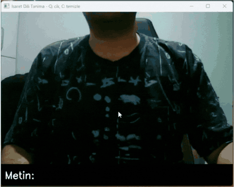

# TİD Parmak Alfabesi Tanıma / Turkish Sign Language Fingerspelling Recognition

Webcam görüntüsünden **Türk İşaret Dili (TİD) parmak alfabesi** harflerini gerçek zamanlı tanıyan makine öğrenmesi projesi. İşitme engelli bireylerle iletişimi kolaylaştırmayı hedefleyen daha büyük bir çift yönlü çeviri sisteminin ilk fazıdır.

> Real-time Turkish Sign Language fingerspelling recognition using MediaPipe hand landmarks and a Random Forest classifier. Includes a custom data-collection tool.

## Nasıl çalışıyor?

```
Kamera → MediaPipe Hands (21 el landmark'ı) → Normalizasyon → Random Forest → Harf → Metin
```

1. **MediaPipe Hands** her karede elin 21 eklem noktasının 3B koordinatlarını verir.
2. Koordinatlar **bileğe göre kaydırılıp el boyutuna göre ölçeklenir** — böylece model elin ekrandaki konumuna değil, *şekline* bakar.
3. **Random Forest** sınıflandırıcı, bu 63 boyutlu özellik vektöründen harfi tahmin eder.
4. Harf ~1 saniye sabit tutulunca metne eklenir; el çekilince kelime arası boşluk konur.

## Kurulum

```bash
pip install -r requirements.txt
```

Python 3.9–3.12 ve webcam gereklidir.

## Kullanım

**1. Veri toplama** — her harf için ayrı çalıştırın, 150–200 örnek kaydedin:

```bash
python 1_veri_topla.py
```

**2. Model eğitimi** — doğruluk raporu verir, `model.pkl` üretir:

```bash
python 2_model_egit.py
```

**3. Gerçek zamanlı tanıma:**

```bash
python 3_gercek_zamanli_tani.py
```

## Teknik detaylar

- **Özellik mühendisliği:** Landmark'lar bileğe (0. nokta) göre orijinlenir ve elin maksimum yayılımına bölünerek ölçek bağımsız hale getirilir. Bu normalizasyon olmadan model, elin kameraya uzaklığını öğrenir — şeklini değil.
- **Model seçimi:** Statik işaretler için tek kare yeterlidir; Random Forest az veriyle hızlı ve yorumlanabilir sonuç verir. Hareketli işaretler (dinamik harfler/kelimeler) LSTM gibi dizi modelleri gerektirir — yol haritasında.
- **Sınırlar:** Şu an tek elli statik işaretlerle sınırlıdır. TİD'de bazı harfler iki el veya hareket içerir.

## Yol haritası

- [ ] İki el desteği ve tam alfabe
- [ ] Ses → metin yönü (Whisper) ile çift yönlü iletişim
- [ ] Streamlit ile tarayıcı arayüzü
- [ ] Hareketli işaretler için LSTM tabanlı dizi modeli

## Teknolojiler

Python · OpenCV · MediaPipe · scikit-learn · NumPy · pandas
